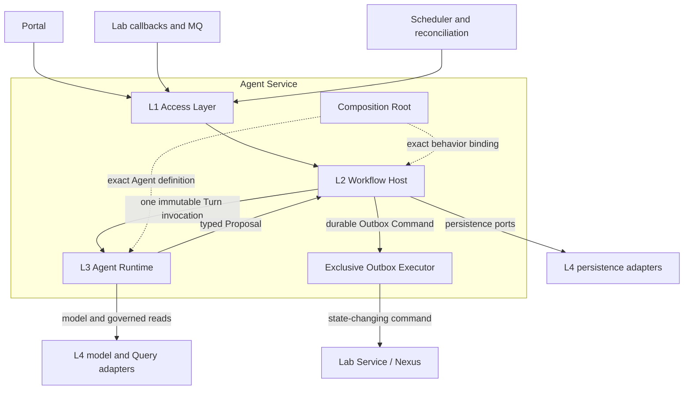
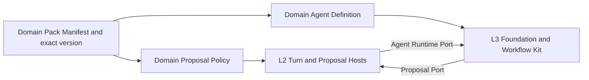
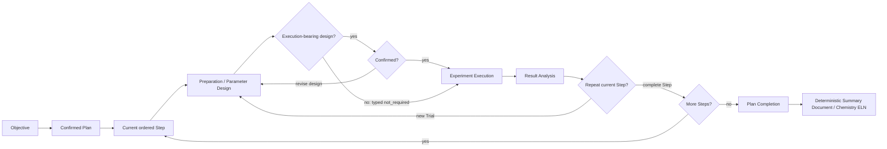
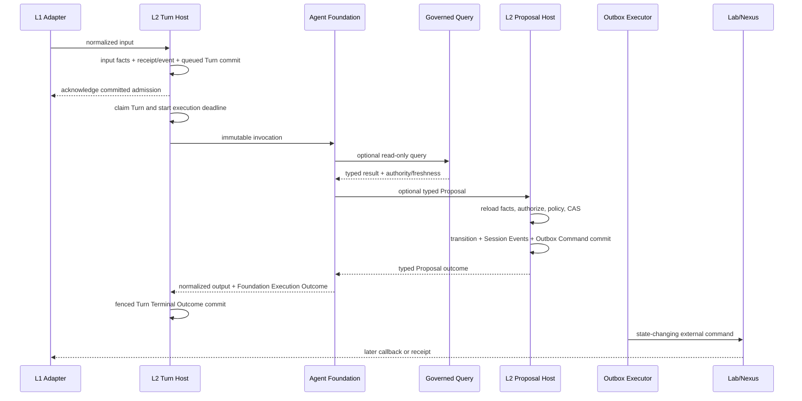
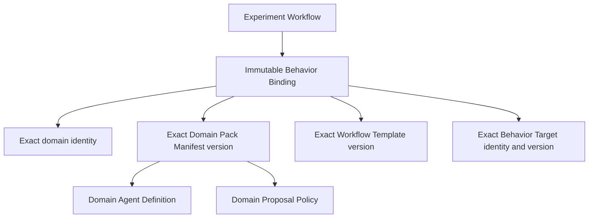
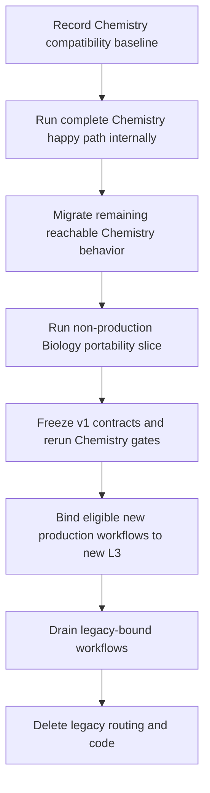

# Agent Service L3 Architecture Redesign

Status: proposed architecture for review
Scope: `BIC-agent-service` internals, plus a separately releasable Portal cancellation slice
External compatibility target: existing Portal, Lab Service, and `BIC-shared-types` contracts
Current-code evidence baseline: `BIC-agent-service` `main@12a84f3238a9`
Last updated: 2026-07-16

## 1. Decision summary

The redesign keeps the L1 through L4 responsibility model and replaces the current Chemistry-shaped L3 composition with three reuse zones: Agent Foundation, an Experiment Workflow Kit, and versioned Domain Packs. L2 remains the only owner of durable workflow change. L3 performs one bounded, stateless Agent Turn and can request change only through a typed Proposal. The outbox executor is the only component allowed to issue state-changing external commands.

V1 standardizes one experiment shape: Objective, confirmed serial Plan, and ordered Steps that each move through Preparation/Parameter Design, Execution, and Result Analysis. A parameterized Step has a deterministic confirmation gate before execution. A manual Step with no system-generated execution parameters returns a typed `not_required` preparation result and does not create a synthetic parameter form or confirmation surface. A confirmed Plan stays fixed. Rework creates another Trial for the same Step. A future workflow topology or Plan Revision requires a new versioned contract.

The first migration path runs a complete Chemistry workflow through the new architecture under production-shaped internal tests. Remaining Chemistry behavior moves in vertical slices. A non-production Biology slice then challenges the shared contracts before they freeze. Existing workflows stay on their immutable implementation binding, so a new-path workflow never falls back to legacy L3 at a later Turn or Step.

The core refactor requires no coordinated Portal, Lab Service, or shared-types release. User-visible Turn cancellation remains an approved, separate Agent Service and Portal slice.

## 2. Why the current structure needs to change

The current Runtime compiles one Chemistry graph and passes the same process-wide dependency bundle into specialist graphs. L3 code can reach Persistence, raw Lab operations, Mind, and MinIO. Some graph paths issue state-changing Lab calls and persist external identifiers during the same coroutine that runs the model. L2 then interprets streamed runtime events to decide which durable mutations to apply.

That shape causes five recurring problems:

- Chemistry specialist topology and reusable Agent execution mechanics live in the same graph factory.
- Model-controlled execution can reach dependencies with broader authority than the current tool needs.
- External command delivery and local persistence do not share one durable transaction boundary, leaving ambiguous-delivery and callback-correlation gaps.
- In-process queueing, process-local locks, and streamed event interpretation carry correctness responsibilities that disappear on restart.
- A deployment replaces the process-global graph and model behavior for unfinished workflows without an authoritative workflow-level version binding.

PR [#94](https://github.com/c12-ai/BIC-agent-service/pull/94) and PR [#136](https://github.com/c12-ai/BIC-agent-service/pull/136) contain useful policy, CAS, derived-view, and outbox work. They also encode overlapping action models and retain several current couplings. This design treats both PRs as sources of parts rather than merge units.

### Goals

- Keep existing Chemistry behavior externally compatible while internal responsibilities move.
- Add another experimental domain without editing domain-neutral L2 or Agent Foundation.
- Give Memory, Skills, MCP, and later Agent features governed entry points without shipping unused frameworks in v1.
- Make layer, authority, and effect boundaries executable in CI and startup validation.
- Recover queued and running Turns safely across process loss without turning a Turn into a durable Agent thread.

### Non-goals

- A new layer taxonomy, microservice split, or untrusted plugin platform.
- A general workflow DSL, arbitrary Domain-owned macro graph, DAG, parallel Steps, or nested Plans.
- Production Biology support or a cross-repo Biology contract.
- Production Memory, general Skill runtime, general MCP gateway, or durable LangGraph checkpoints.
- In-place migration of an active workflow to a different Domain Pack or Workflow Template version.
- Exact terminal fields, Proposal Outcome names, or action-state diagrams before their consumer-driven catalogs finish review.

## 3. Architectural coordinates

L1 through L4 remain the only architectural layers. Foundation, the Workflow Kit, Domain Packs, and the Proposal boundary describe reuse or authority inside those layers.

| Layer | Stable responsibility | Internal structure allowed to change |
|---|---|---|
| L1 Access Layer | Decode HTTP, SSE, MQ, scheduler, and reconciliation inputs; call one L2 entry; encode compatible output | Routes, modules, and adapter placement |
| L2 Workflow Host | Admit inputs, own Workflow Facts, coordinate cross-Turn progress, adjudicate Proposals, append Session Events, and create Outbox Commands | Current reducer, queue, and helper boundaries |
| L3 Agent Runtime | Execute one Turn of probabilistic reasoning through governed model, context, Query, and Proposal capabilities | Current Y-4 graph and Chemistry specialist topology |
| L4 Infrastructure Adapters | Implement persistence, model, Query, message, object-store, and external-command ports | Current client and repository packaging |

The Composition Root is the sole reviewed wiring location. It validates trusted installed Domain Pack and Workflow Template versions, their contract ranges, tool classifications, port requirements, model level declarations, and granted capabilities before serving traffic.

## 4. State and lifecycle authority

Each kind of state has one owner.

| State | Authority | Role of other representations |
|---|---|---|
| Experiment, Plan, Step, Trial, confirmation, and workflow cursor | L2 Workflow Model | Agent context and Portal snapshots are views |
| Physical execution status and scientific execution facts | Lab Service / Nexus | Agent Service stores correlated receipts and projections |
| Turn admission, claim, fence, and Turn Terminal Outcome | L2 durable Turn record | LangGraph state and traces are execution evidence |
| Session Events | L2 append-only event stream | Audit, UI projection, and replay; not a competing workflow aggregate |
| Agent State | L3 transient serializable state | Working data for one Turn; never authoritative business state |

Live SSE, replay, and cold snapshots may use different transports, but they must project the same committed facts. A Session Event can report a transition after L2 commits it. The event cannot authorize the transition that it reports.

The redesign keeps four lifecycle identities separate:

| Identity | Question it answers |
|---|---|
| Turn | Did one normalized input finish its bounded Agent execution? |
| Proposal | Did L2 accept the requested business action against current facts and policy? |
| Outbox Command | What happened to one authorized external delivery? |
| Lab/Nexus Task | What did the physical execution authority report? |

A Turn can fail during post-commit narration while its accepted Proposal and Outbox Command remain valid. A Lab Task can complete after the Turn that requested it has already reached a Turn Terminal Outcome.

## 5. L2 and L3 meet at two typed seams

The Domain Pack spans the L2/L3 boundary at composition time through two capability-limited faces. Runtime execution still uses one L2-to-L3 entry.

### Agent Runtime Port

L2 invokes one admitted Turn with immutable identity, Principal, locale, workflow references, exact behavior binding, execution policy, and current authoritative context references. L2 cannot select a specialist, graph node, prompt, or tool. L3 returns normalized runtime output and exactly one machine-readable Foundation Execution Outcome. L2 maps that result, together with authoritative lifecycle facts, to one durable Turn Terminal Outcome.

The port cannot expose Persistence, transaction handles, raw Lab clients, concrete graph state, or an iterator whose exhaustion is the only completion signal.

### Proposal Port

L3 supplies a typed domain intent payload. Trusted runtime code adds the Principal, workflow and Turn identities, exact component versions, target, concurrency preconditions, stable Proposal identity, and provenance. L2 reloads current facts, applies global authorization and the matching Domain Proposal Policy, then commits the transition, Session Events, and any Outbox Commands in one short transaction.

No database transaction or entity lock remains open while the system waits for a model, graph continuation, narration, or external Query.

## 6. Three reuse zones

| Reuse zone | Owns | Does not own |
|---|---|---|
| Agent Foundation | Model invocation, context budgeting, governed tool dispatch, public LangGraph integration, stream normalization, deadlines, cancellation propagation, telemetry, and one Foundation Execution Outcome | Experiment progression, scientific semantics, persistence, durable Turn terminals, or external commands |
| Experiment Workflow Kit | Objective, Plan, serial Step cycle, confirmation gates, Trial progression, execution correlation, Plan completion, and Summary orchestration through layer-aligned L2/L3 components | Runtime authority, persistence, a base Domain Pack, or a general workflow language |
| Domain Pack | Scientific schemas, prompts, Step definitions, parameter design, evidence interpretation, result analysis, domain Proposal policy, and typed deterministic report contributions | Shared Agent mechanics, shared experiment topology, transaction ownership, report gating, or command execution |

The Kit owns the v1 macro topology. A Domain Pack supplies typed scientific behavior inside that topology. It cannot return an arbitrary precompiled graph or unrestricted executable node. A future parallel, DAG, nested, or additional-phase workflow needs another versioned Workflow Template.

Shared behavior moves into the Kit only after Chemistry and Biology use the same contract with the same semantics. Similar-looking prompts, schemas, evidence rules, or transition thresholds stay in their Domain Pack.

### Domain Pack composition

Each trusted static Domain Pack exposes two faces from one exact Manifest version:

| Face | Consumer | Main contributions |
|---|---|---|
| Domain Agent Definition | L3 Foundation and Workflow Kit | Typed Step Definitions, phase capabilities, prompts, context, classified tools, evidence interpretation, loop intent, and user-facing narration |
| Domain Proposal Policy | L2 Proposal Host | Pure domain preconditions, typed policy decisions, and deterministic transition plans over immutable current-fact views |

The faces may share neutral versioned contracts. They do not import each other or share mutable runtime objects. Generic L2 owns fact loading, authorization, CAS, transactions, aggregate mutation, event append, and outbox creation.

The Manifest declares the domain identity and version, compatible Foundation, Workflow Template, and Proposal contract ranges, both factories, required ports and permissions, and the `light` or `complex` level declared by each hosted Agent graph. It is composition metadata, not a workflow DSL.

## 7. V1 experiment workflow

V1 fixes one serial experiment workflow that can support Chemistry and the validation Biology domain.

The three shared capability phases inside a Step are Preparation/Parameter Design, Experiment Execution, and Result Analysis. Confirmation is a deterministic gate only when the preparation result contains an execution-bearing design. For a manual Step that needs no system-generated parameters, the preparation capability returns typed `not_required`; the Portal receives no fabricated robot parameters, empty form, or new confirmation prompt. The Step then uses the existing human-completion and evidence interaction during execution. Robot and manual Steps still share Trial, analysis, review, progression, and completion mechanics.

L2 owns the ordered Plan, current Step, confirmation state, Trial identity, and serial progression. Each callback or reconciliation signal becomes a new durable input and a new stateless Turn. One Step may be active for execution at a time.

### Confirmed Plan and rework

A confirmed Plan is immutable in v1. Result Analysis may request another Trial for the current Step. The new Trial keeps the same Plan and Step identity, repeats any parameter design and confirmation required by that Step's execution mode, and preserves earlier Trial evidence. It cannot insert, remove, replace, or reorder a planned Step.

Plan Revision remains outside v1. The design reserves no revision columns, APIs, lineage views, or Portal behavior before a product use case defines the semantics.

### Typed Step Definitions

A Domain Agent Definition supplies coherent typed Step Definitions. Each definition refers to narrow phase capabilities for Step identity and language, Preparation/Parameter Design, Execution Intent, evidence interpretation, Result Analysis, and an optional typed loop intent. The preparation result is typed as either an execution-bearing design or `not_required`; exact field and variant names remain provisional.

In Chemistry v1, the architectural `Summary Document` is the existing deterministic, AI-free ELN report artifact. The Workflow Kit owns completion gating and report orchestration. The Chemistry Domain Pack supplies typed deterministic report data and sections derived only from confirmed Workflow Facts and Physical Execution Facts. Any Agent-generated closing narration is a separate conversation output: it cannot provide report facts, alter the ELN, or replace it.

The aggregate must stay small. It cannot become a long optional-callback record, use `Any` as a cross-boundary payload, carry mutable runtime state, expose a service locator, or split one Step across unrelated registries that require runtime casts to reconstruct its types.

## 8. Turn execution and effect isolation

One Turn is one bounded execution of one normalized admitted input. Admission allocates `turn_id`; execution begins when a worker claims the durable record; L2 ends the Turn by committing one Turn Terminal Outcome.

### Durable admission and recovery

Input Admission commits the deterministic input-driven fact transition, input receipt or Session Event, and immutable queued Turn in one transaction. HTTP or MQ acknowledgement follows the commit. The in-memory queue may wake workers but cannot be the correctness path.

The Turn row has three operational states: `queued`, `running`, and `terminal`. Completion, failure, timeout, and cancellation are typed Turn Terminal Outcome data rather than more row states. Foundation Execution Outcome names the invocation-level result before this durable L2 closure; Execution Closure and Persistence Closure remain distinct moments.

A reclaim keeps the same logical `turn_id` and atomically increments `claim_generation`. Proposal acceptance, output persistence, terminal writes, and live broadcasts verify the current generation. A resumed stale claimant has no write or broadcast authority. V1 does not create a Turn Attempt aggregate, public Attempt ID, Attempt events, or durable graph checkpoint.

The first successful claim assigns one absolute `execution_deadline_at`. Reclaims and internal retries consume the same budget. Queue latency is measured separately. Outbox and Lab Task deadlines remain independent.

### One accepted effect per Turn

L2 may reject several Proposal candidates while an Agent corrects its intent. It may accept at most one business Proposal for a Turn. The accepted action may update several related entities, append ordered compatibility events, and create correlated Outbox Commands in one transaction.

After acceptance, the Turn's effect capability closes. Foundation may finish pure or read-only work and grounded narration, but later Proposal calls cannot commit another business action. A failure after acceptance does not reopen the slot.

### Exclusive external-command authority

Only the outbox executor can call a state-changing external adapter. This rule includes deterministic TLC operations, reconciliation, model-originated intents, and future MCP-backed commands. An Outbox Command receives a stable BIC command identifier before dispatch so callbacks can correlate even when they arrive before the synchronous response path completes.

Automatic retries stay disabled for a command type until the receiving system proves that it persists and honors the same BIC idempotency key. Ambiguous delivery is an explicit command outcome, not inferred success.

Foundation and trusted Domain Packs remain in the Agent Service process for v1. Isolation comes from imports, types, object-graph validation, capability grants, and the absence of mutation credentials or adapters in L3 composition. Untrusted executable extensions require a separate process or sandbox design.

## 9. Tool and Query model

Every model-facing tool belongs to one category.

| Category | Model visible | Runtime behavior |
|---|---:|---|
| Pure Tool | yes | Runs inside the invocation with schema validation and telemetry |
| Read-Only Query Tool | yes | Uses a governed Query port with Principal, allowlist, deadline, rate-limit, audit, authority, and freshness checks |
| Proposal Tool | yes | Produces a typed intent payload for trusted Proposal construction |
| External Command | no | Runs only in the outbox executor after an accepted Proposal transaction |

Read-only classification comes from reviewed semantics, not an HTTP verb or remote tool description. A Query Result identifies its authority, source reference, observation time, and freshness. It can inform model reasoning. It cannot overwrite Workflow Facts or trigger a workflow mutation without a Proposal.

L3 receives capability-shaped ports. It never receives a mixed read/write client, raw MCP session, persistence handle, network credential, or generic service container.

## 10. Behavior and model binding

An experiment may span several deployments. L2 therefore commits one immutable Workflow Behavior Binding before the first domain Agent invocation.

Every user, callback, scheduler, and reconciliation Turn reloads the same binding. Its exact Behavior Target identifies the internal runtime implementation used for the workflow lifetime, including whether coexistence resolves to the reviewed legacy compatibility target or the new Foundation/Kit/Pack target. Exact storage fields remain provisional, but the resolution itself is immutable: it cannot be replaced by a deployment mapping, per-Turn or per-Step branch, or failure fallback. A deployment default selects only a newly created workflow. Existing workflows do not upgrade or fall forward to another compatible version. If the exact target or one of its exact component versions is missing, execution fails closed before behavior-dependent reasoning or Proposal acceptance.

Old and new Behavior Targets may coexist while active workflows reference them. A referenced target or component version cannot be retired. Pre-existing workflows receive an explicit reviewed legacy compatibility binding before version-bound dispatch; a null binding never means latest.

### Model capability levels

V1 has exactly two provider-neutral levels: `light` and `complex`. Every hosted Agent graph declares one level. Foundation maps the level to an approved concrete model. Domain Packs cannot add levels, and graph nodes, prompts, Skills, or clients cannot choose a provider or model at runtime.

The concrete mapping may change after the tests and rollout gates for that level pass. The workflow binding stays unchanged. Foundation records per-call provenance containing the hosted graph, declared level, actual provider/model, and supported operational metadata. Exact provider or revision pinning requires a separate regulatory or reproducibility policy.

## 11. Memory, Skills, and MCP

Memory, Skills, and MCP share admission and governance rules while keeping separate typed interfaces.

| Capability family | Meaning | Allowed path |
|---|---|---|
| Memory | Scoped retained knowledge | Lower-authority context reads; trusted lifecycle writes or adjudicated Memory Proposals |
| Domain Skill | Trusted behavior contribution | Prompt/context contributions and declared Pure, Query, or Proposal Tools at a specific domain, Step, and phase |
| MCP | Integration transport and operation catalog | Each operation maps independently to Query, Proposal intent, or an executor-only External Command adapter |

The Composition Root resolves configured trusted providers and grants the smallest capability needed by the consumer. No generic `invoke(name, payload)` bus, provider registry, raw store, raw MCP client, or dynamic loader crosses into Domain code.

Memory cannot override Workflow Facts, Physical Execution Facts, current permissions, or durable lifecycle state. A Skill cannot widen its grant, replace Workflow topology, become the Domain Proposal Policy, or execute an external command. An MCP server cannot declare itself trusted or read-only as a whole.

V1 ships only neutral seams exercised by Chemistry or the Biology validation slice: typed context contributions, classified tool hosting, Manifest requirements and grants, and default-deny composition validation. Three non-production fixtures test the geometry: a Biology-phase Skill-shaped contribution, a fake allowlisted MCP Query, and an in-memory memory-like context contributor. They do not establish production provider APIs.

## 12. External compatibility and cancellation

Every core migration slice must run against unchanged compatible Portal, Lab Service, and `BIC-shared-types` versions. Compatibility covers REST behavior, snapshots, SSE kinds and ordering, replay and error semantics, MQ and HTTP identity/correlation, evidence propagation, locale, confirmation gates, and ELN eligibility. Internal rows, package names, and unobservable timing may change.

User-visible cancellation is the one approved additive contract. It gives Portal a chatbot-style Stop action for an exact queued or running user-triggered Turn. Cancellation commits a terminal result before cooperative cleanup and races Proposal acceptance at one L2 serialization point. A command already committed through Outbox remains valid. The detailed API fields, authorization matrix, deadline race, and partial-output rules live in the [cancellation catalog](../../.trellis/tasks/07-15-agent-service-l3-redesign/turn-cancellation-catalog.md) and ship as a separate Agent Service and Portal slice.

The core L3 refactor does not require a Portal or shared-types release. Production Biology contracts remain a separate roadmap.

### Candidate PR disposition

| Candidate work | Target disposition |
|---|---|
| #94 policy outcomes and stable reason codes | Adapt into Chemistry Domain Proposal Policy and error translation |
| #94 admission and middleware checks | Keep only as non-authoritative preflight where they improve UX or defense in depth |
| #94 Chemistry action and stage taxonomy | Replace with the single Proposal taxonomy |
| #136 derived Baton | Adapt as a non-authoritative Chemistry Workflow View |
| #136 CAS, locking, and engine mechanics | Adapt into the single L2 Proposal transaction |
| #136 outbox repository and worker base | Adapt to executor-owned dispatch and per-command retry gates |
| #136 specialist registry and transition table | Move Chemistry behavior into the Domain Pack; do not treat it as Foundation |
| #136 synchronous L3 Lab dispatch | Drop |
| Unapproved wire additions | Drop or review as separate compatible product changes |

## 13. Vertical migration

The migration uses end-to-end slices around stable external contracts.

The first path covers Objective, confirmed Plan, ordered Chemistry Steps, applicable parameter confirmation, Lab dispatch and callbacks, result analysis, Plan completion, deterministic ELN generation, Portal projections, and replay. It begins behind internal or disabled routing. Happy-path success does not make arbitrary production workflows eligible for new L3.

Trusted L2 release policy chooses an exact legacy or new Behavior Target only when it creates and binds a workflow. Every later Turn and Step stays on that implementation. The system cannot choose by mutable deployment mapping, model output, future Plan shape, current Step, or failure branch. It cannot fall back to legacy after a new binding.

A production cohort becomes eligible only after all behavior reachable by that cohort has migrated and passed its gates, the non-production Biology portability slice has passed, the Agent Foundation public SPI, Experiment Workflow Template/Kit contracts, and Domain Pack contract have frozen, and every migrated Chemistry slice has passed again against that frozen set. Before this combined gate, new behavior may run only through internal or disabled routing. Callback, scheduler, and reconciliation Turns reload the originating binding. Effectful shadow runs, dual writes, duplicate Proposal acceptance, and a second command path are prohibited.

Persistence changes follow expand, migrate, contract. Every intermediate version can be read and written by the old and new components that may run together. Destructive contraction waits until no queued, running, recoverable, or otherwise eligible workflow still references legacy behavior.

The Biology slice runs after the production-shaped Chemistry path and before contract freeze. It may reshape the provisional Agent Foundation public SPI, Experiment Workflow Template/Kit contracts, and Domain Pack contract. After that set freezes, every migrated Chemistry slice reruns, whether or not the change appeared to affect it. Legacy code leaves the repository only after parity, zero eligible legacy bindings, external compatibility, and rollback gates pass.

## 14. Delivery slices

The design maps to one parent program and six independently verifiable core slices. Dependencies belong in each child task artifact and cannot be inferred from list position alone.

| Slice | Deliverable | Exit condition |
|---|---|---|
| Compatibility baseline and architecture gates | External behavior inventory, PR adopt/adapt/drop matrix, Import Linter contracts, strict boundary typing, composition and negative fixtures | CI can reject forbidden dependencies and the baseline can detect external drift |
| Durable Turn, Proposal, and Outbox | Durable admission/claim/fence/terminal flow, one-effect Proposal transaction, exclusive executor semantics | Concurrency and failure injection prove one transition, event trajectory, and command intent |
| Foundation, Workflow Kit, and Chemistry happy path | Governed Runtime Port, Foundation, serial workflow components, Chemistry Domain Pack path | Full Chemistry happy path passes production-shaped internal gates |
| Remaining Chemistry and coexistence | Alternate, rejection, retry, recovery, manual, loop, and failure paths; exact old/new Behavior Targets | A named cohort has complete reachable-path coverage and no fallback path; routing remains internal or disabled |
| Biology portability and contract freeze | Minimal Biology Domain Pack and Lab simulator through the same seams | Biology passes without neutral-core domain branches; Foundation public SPI, Kit/Template, and Pack contracts freeze; all migrated Chemistry gates rerun |
| Cutover and legacy retirement | Production cohort admission after the combined gate, legacy drain, contraction, deletion, rollback evidence | Zero eligible legacy bindings and no legacy routing or code remain |

Turn cancellation is a separate child slice. It may use the durable Turn primitives after their contract is stable, but it does not block the core architecture path or broaden Lab/shared contracts.

## 15. Enforcement and validation

Documentation alone cannot maintain these boundaries.

| Gate | Property it proves |
|---|---|
| Ruff and banned-API checks | Fast feedback for universally forbidden imports and framework-private APIs |
| Import Linter | Direct and transitive L1-L4 direction, Foundation independence, Domain Pack isolation, and L4 leaf rules |
| Strict Pyright boundary configuration | No `Any`, mixed read/write client, unchecked cast, or generic service container crosses a protected seam |
| Architecture and object-graph tests | Composition injects only declared ports and cannot recover raw Persistence or command clients through closures |
| Startup Manifest validation | Every component, tool, model level, port, and grant is classified, compatible, and default-deny |
| Transaction and failure-injection tests | Admission, Proposal, event append, terminal closure, outbox, cancellation, and recovery preserve their ordering and uniqueness |
| Contract, golden, replay, and live-bench tests | Portal, Lab, snapshots, SSE, replay, confirmation, evidence, and ELN behavior remain semantically compatible |
| Chemistry deletion and Biology portability tests | Neutral Foundation and Kit code contains no concrete-domain dependency or hidden duplicated topology |

Each architecture rule needs a negative fixture. CI must fail when a test Domain Pack asks for an undeclared capability, a graph receives a raw command client, L3 imports persistence, an external command runs before commit, or a stale claim tries to emit output.

## 16. Frozen decisions and deferred details

The PR asks reviewers to approve these architecture decisions:

- L1 through L4 responsibilities and entity-authoritative, event-projected state.
- Agent Foundation, Experiment Workflow Kit, and Domain Pack reuse zones.
- Two Domain Pack faces and one domain-neutral Agent Runtime Port plus Proposal Port.
- In-process hard capability isolation for trusted v1 code.
- One accepted business Proposal per Turn and executor-only external commands.
- Durable Input Admission, three Turn row states, claim-generation fencing, and one absolute execution deadline.
- The serial v1 experiment workflow, immutable confirmed Plans, and Trial-based same-Step rework.
- Typed Step Definitions under Kit-owned macro topology.
- Workflow-lifetime exact Behavior Target binding and the `light`/`complex` graph model levels.
- Typed, demand-gated Memory, Skill, and MCP capability families.
- Chemistry-first vertical slices, Biology-before-freeze validation, and workflow-scoped legacy coexistence.

These details remain provisional and must pass their linked design gates before implementation freezes a schema:

- Exact Python protocols and package names.
- Proposal Outcome names and the complete action-state transition matrix.
- Query Result and context-contribution fields.
- Foundation Execution Outcome and Turn Terminal Outcome fields, their mapping, and retention; `failure_stage` remains telemetry-only internally and compatibility-only on the legacy wire unless a named consumer proves otherwise.
- Behavior-binding column names, identifier syntax, legacy backfill mechanics, and version-retention operations.
- Command lease, recovery, ambiguous-delivery, ordering, and idempotency mechanics.
- Exact cancellation JSON spellings and mixed-version release mechanics.
- Production Memory, Skill, MCP, process isolation, and exact-model pinning policies.

## 17. Review and source material

The canonical requirements, detailed working design, catalogs, evidence, and decision records remain available for reviewers who need to inspect a specific contract:

- [Requirements and acceptance criteria](../../.trellis/tasks/07-15-agent-service-l3-redesign/prd.md)
- [Detailed working design](../../.trellis/tasks/07-15-agent-service-l3-redesign/design.md)
- [Production product contract](../../Production-PRD.md)
- [Shared vocabulary](../../CONTEXT.md)
- [Turn and external-execution isolation](../../.trellis/tasks/07-15-agent-service-l3-redesign/turn-execution-isolation.md)
- [Turn terminal outcome catalog](../../.trellis/tasks/07-15-agent-service-l3-redesign/turn-terminal-outcome-catalog.md)
- [Action-state transition catalog](../../.trellis/tasks/07-15-agent-service-l3-redesign/action-state-transition-catalog.md)
- [User Turn cancellation catalog](../../.trellis/tasks/07-15-agent-service-l3-redesign/turn-cancellation-catalog.md)
- [Architecture Decision Records](../adr/)
- [Original Feishu discussion](https://carbon12.feishu.cn/docx/Vm6RdmhZCoBvTCx3VlucX3UFnbg)

This document approves no code implementation by itself. Each delivery slice needs its own reviewed Trellis plan, dependency statement, validation commands, and rollback point before execution starts.
